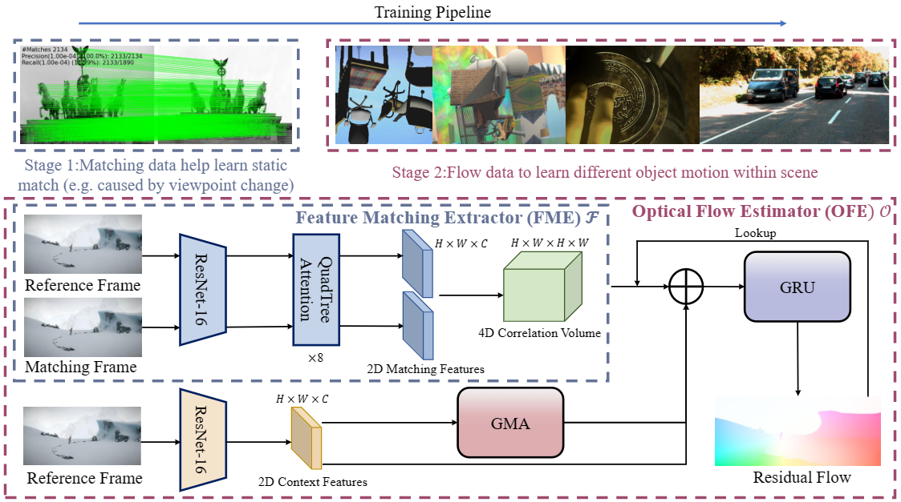

# MatchFlow
### [Paper](https://arxiv.org/abs/2303.08384)
> [**Rethinking Optical Flow from Geometric Matching Consistent  Perspective**](https://arxiv.org/abs/2303.08384)            
> Qiaole Dong, Chenjie Cao, Yanwei Fu        
> **CVPR 2023**



## Requirements
The code has been tested with PyTorch 1.10.1 and Cuda 11.3.
```Shell
conda create --name matchflow python=3.6
conda activate matchflow
pip install torch==1.10.1+cu113 torchvision==0.11.2+cu113 torchaudio==0.10.1 -f https://download.pytorch.org/whl/cu113/torch_stable.html
pip install matplotlib imageio einops scipy opencv-python tensorboard yacs timm pytorch_lightning
cd QuadTreeAttention
python setup.py install
cd ../
```

## Required Data
To evaluate/train MatchFlow, you will need to download the required datasets. 
* [FlyingChairs](https://lmb.informatik.uni-freiburg.de/resources/datasets/FlyingChairs.en.html#flyingchairs)
* [FlyingThings3D](https://lmb.informatik.uni-freiburg.de/resources/datasets/SceneFlowDatasets.en.html)
* [Sintel](http://sintel.is.tue.mpg.de/)
* [KITTI](http://www.cvlibs.net/datasets/kitti/eval_scene_flow.php?benchmark=flow)
* [HD1K](http://hci-benchmark.iwr.uni-heidelberg.de/) (optional)


By default `datasets.py` will search for the datasets in these locations. You can create symbolic links to wherever 
the datasets were downloaded in the `datasets` folder

```Shell
├── datasets
    ├── Sintel
        ├── test
        ├── training
    ├── KITTI
        ├── testing
        ├── training
        ├── devkit
    ├── FlyingChairs_release
        ├── data
    ├── FlyingThings3D
        ├── frames_cleanpass
        ├── frames_finalpass
        ├── optical_flow
```

## Evaluation
You can evaluate a trained model using `main.py`
```Shell
unzip ckpts.zip
bash evaluate.sh
```

## Training
Stage 1: We train the FME following [QuadTreeAttention](https://github.com/Tangshitao/QuadTreeAttention), and our pre-trained 
FME is downloaded from [QuadTreeAttention](https://github.com/Tangshitao/QuadTreeAttention) and can be found in ckpts.zip.

Stage 2: We used the following training schedule in our paper (2 GPUs). Training logs will be written to the `runs` which can be 
visualized using tensorboard.
```Shell
unzip ckpts.zip
bash train_standard.sh
```

## Reference
If you found our paper helpful, please consider citing:
```bibtex
@inproceedings{dong2023rethinking,
  title={Rethinking Optical Flow from Geometric Matching Consistent  Perspective},
  author={Dong, Qiaole and Cao, Chenjie and Fu, Yanwei},
  booktitle={Proceedings of the IEEE/CVF Conference on Computer Vision and Pattern Recognition},
  year={2023}
}
```

## Acknowledgement

Thanks to previous open-sourced repo: 
* [RAFT](https://github.com/princeton-vl/RAFT)
* [GMA](https://github.com/zacjiang/GMA)
* [QuadTreeAttention](https://github.com/Tangshitao/QuadTreeAttention)